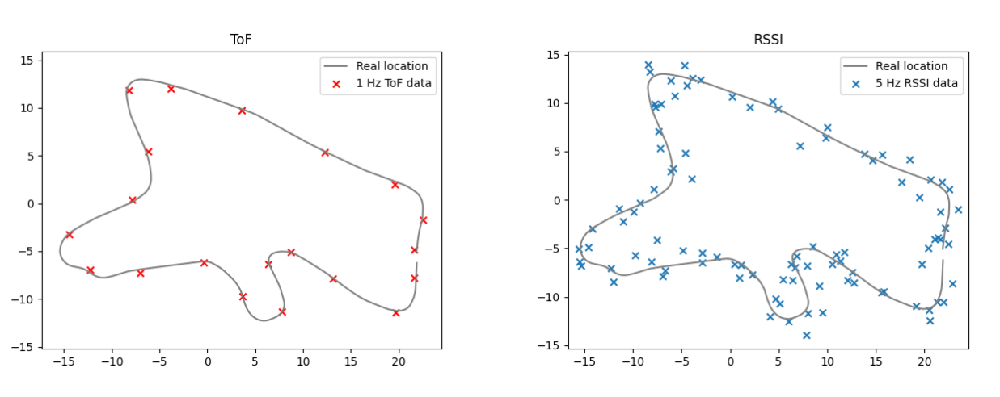
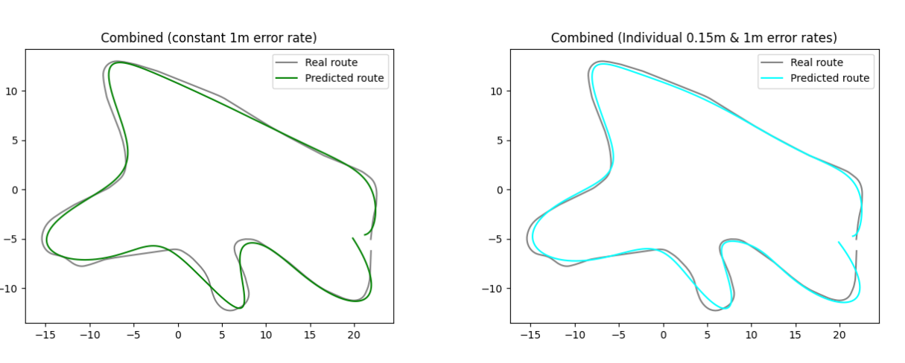

# Gaussian Process for ToF and RSSI localization

This repository holds Gaussian Process implementation for a localization task. The task is a miniature car racing localization. The data is collected using OpenAI gym car racing simulator. The data was scaled to match 30m x 30m training plane. Two datasets were then generated from the data; ToF data and RSSI data. ToF data was sampled at 1Hz and RSSI data with 5Hz. Noise in ToF data was Gaussian Distributed with zero mean and standard deviation of 0.15m. See the [blog text](https://medium.com/@miikka.sainio/gaussian-process-for-tof-and-rssi-localization-67b0b8f3e12) for more information.

The structure of the dataset is following:

real_position.npy : 4 features, [time, speed (m/s), x-position (m), y-position (m)]

tof_1hz.npy : 4 features, [time, , speed (m/s), x-position (m), y-position (m)]

rssi_1hz.npy : 4 features, [time, , speed (m/s), x-position (m), y-position (m)]

Data visualization

GP predicted route visualization

GP predicted real-time visualization

